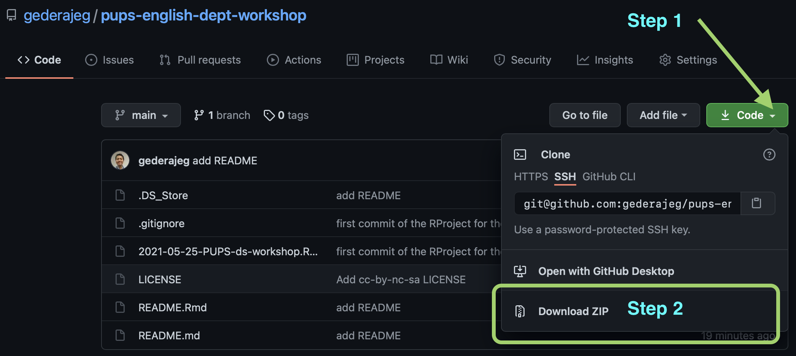

<!-- README.md is generated from README.Rmd. Please edit that file -->

```{r, include = FALSE}
knitr::opts_chunk$set(
  collapse = TRUE,
  comment = "#>"
)
```


<a rel="license" href="http://creativecommons.org/licenses/by-nc-sa/4.0/"></a><br />Materi lokakarya dalam repositori GitHub ini diberikan lisensi <a rel="license" href="http://creativecommons.org/licenses/by-nc-sa/4.0/">Creative Commons Attribution-NonCommercial-ShareAlike 4.0 International License</a>.

<!-- badges: start -->
<!-- badges: end -->

## Pendahuluan

Lokakarya daring ini ditujukan untuk dua orang anggota peneliti mahasiswa yang menjadi bagian dari Penelitian Unggulan Program Studi (PUPS) berjudul [__MODEL KAJIAN TERJEMAHAN BERBASIS BANK DATA TERJEMAHAN DIGITAL INGGRIS-INDONESIA DAN IMPLIKASI PEDAGOGISNYA__](https://udayananetworking.unud.ac.id/lecturer/research/880-gede-primahadi-wijaya-rajeg/a-model-for-translation-study-based-on-english-indonesian-translation-database-and-its-pedagogical-implication-1179) (ketua tim peneliti: Gede Primahadi Wijaya Rajeg) pada Program Studi [__Sastra Inggris__](https://sasing.unud.ac.id), [__Fakultas Ilmu Budaya__](https://fib.unud.ac.id), [__Universitas Udayana__](https://www.unud.ac.id), Bali. Dalam lokakarya ini, mahasiswa diajarkan pemahaman dasar dalam pengelolaan dan analisis data kuantitatif menggunakan Microsoft Excel dan bahasa pemrograman [R](https://www.r-project.org). Data yang digunakan dalam lokakarya ini berasal dari sebagian data penelitian tersebut.

Tujuan diadakannya lokakarya ini adalah untuk membekali mahasiswa bidang humaniora keterampilan dasar dalam pengolahan data kuantitatif mutakhir untuk penelitian mereka nantinya (mis. dalam penulisan tugas akhir). Hal ini penting karena penelitian-penelitian dalam bidang ilmu humaniora, khususnya bahasa/linguistik, setakat ini mulai memanfaatkan data kebahasaan berukuran besar (yaitu korpus bahasa), serta menggabungkan pendekatan kuantitatif dan kualitatif.

## Pokok bahasan

Berikut ini adalah pokok-pokok bahasan dalam lokakarya kali ini:

1) Hari Pertama
    a) Penyimpanan data kebahasaan dan analisis kualitatif terkait variabel-variabel linguistik yang dikaji (*coding*/*annotation*) dalam MS Excel.
    a) Menyarikan secara kuantitatif hasil analisis kualitatif dalam MS Excel.
    a) Mengekspor data dalam format MS Excel ke dalam format *Tab-separated Plain Text* untuk nantinya diolah menggunakan R.
1) Hari Kedua - Hari Keempat
    a) Mengunggah data tabel ke R dan eksplorasi lanjutan (mis. menyaring observasi). (H2)
    a) Menyarikan secara kuantitatif (mis. menghitung hasil observasi dari) analisis kualitatif dengan R. (H3)
    a) Visualisasi dasar (mis. diagram batang) untuk variabel nominal/kategorikal/kualitatif. (H4)

## Peranti yang perlu disiapkan

Peranti yang diperlukan untuk lokakarya ini adalah MS Excel, [R](https://cran.r-project.org), dan juga [RStudio](https://www.rstudio.com/products/rstudio/download/). R dan RStudio dapat diunduh secara gratis.

Setelah mengunduh R dan RStudio, silakan install packages dari [`tidyverse`](https://www.tidyverse.org) melalui console R secara keseluruhan. Ketik kode berikut lalu tekan ENTER (**instalasi memerlukan internet**):

```{r eval = FALSE}
install.packages("tidyverse")
```

atau install satu persatu package tersebut (disarankan menggunakan cara sebelumnya):

```{r eval = FALSE}
install.packages(c("dplyr", "tidyr", "ggplot2", "readr", "stringr", "purrr", "tibble", "forcats"))
```

Gambar-gambar berikut menunjukkan proses instalasi `tidyverse` yang sedang berjalan melalui konsol aplikasi R (untuk Windows) -- Kontribusi foto berasal dari Ketut Santi Indriani, S.S., M.Hum (Prodi Sastra Inggris, Fakultas Ilmu Budaya, Universitas Udayana).

1. Proses instalasi sedang berjalan (1)

    
    
2. Proses instalasi sedang berjalan (2)

    
    
3. Proses instalasi completed (ditandai dengan keterangan "the downloaded binary packages are in ....")

    

Untuk memastikan package `tidyverse` telah terinstal, jalankan kode `library(tidyverse)` pada konsol R. Gambar berikut akan muncul:

```{r echo = FALSE}
knitr::include_graphics("loadtidyverse.png")
```

## Cara mengunduh materi

1. Kunjungi laman: https://github.com/gederajeg/pups-english-dept-workshop

2. Kemudian, perhatikan kotak hijau bertuliskan `Code`. Klik tanda panah putih kecil pada kotak hijau tersebut, lalu pada kotak dialog yang keluar, pilih `Download ZIP`. Perhatikan gambar berikut:

    

3. Selanjutnya silakan ekstraksi (*unzip*) berkas ZIP tersebut jika, setelah mengunduh, tidak secara otomatis diekstraksi/di-*unzip*.

4. Kemudian, materi lokakarya akan terdapat dalam direktori (*folder*) dengan nama `pups-english-dept-workshop-main`. Perhatikan gambar berikut:

    

    Data utama untuk lokakarya ditunjukkan oleh berkas bernama `ROB_sample_conc_main.xlsx` (format MS Excel) dan `ROB_sample_conc_main.tsv` (format *Tab-separated plain text*). Berkas dengan awalan angka 1 - 3 dan diakhiri dengan `.R` adalah kode pemrograman R yang berisi langkah-langkah pengolahan data, dan analisis kuantitatif dan visualisasi dasar yang menjadi topik bahasan lokakarya.

5. Selanjutnya, klik dua kali berkas dengan nama `2021-05-25-PUPS-ds-workshop.Rproj` untuk membuka peranti RStudio yang berkaitan dengan bahan-bahan lokakarya dalam direktori tersebut. Gambar berikut memperlihatkan tampilan RStudio yang terbuka setelah meng-klik `2021-05-25-PUPS-ds-workshop.Rproj`:

    
    
    Panel di pojok kanan bawah menampilkan isi direktori/folder dari `pups-english-dept-workshop-main`.
