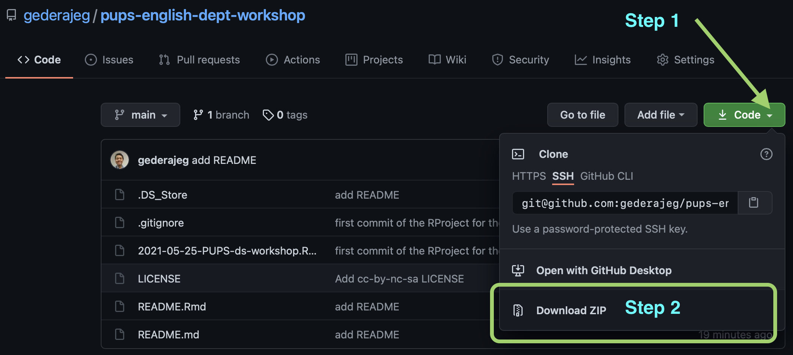
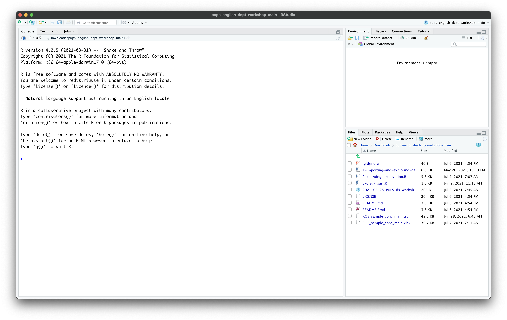

Lokakarya Dasar-dasar Pengolahan Data menggunakan MS Excel dan R -
Penelitian Unggulan Program Studi (PUPS)
================
Instruktur: [Gede Primahadi Wijaya
Rajeg](https://udayananetworking.unud.ac.id/lecturer/880-gede-primahadi-wijaya-rajeg)

<!-- README.md is generated from README.Rmd. Please edit that file -->

 Materi
lokakarya dalam repositori GitHub ini diberikan linsesi
<a rel="license" href="http://creativecommons.org/licenses/by-nc-sa/4.0/">Creative
Commons Attribution-NonCommercial-ShareAlike 4.0 International
License</a>.

<!-- badges: start -->
<!-- badges: end -->

## Pendahuluan

Lokakarya daring ini ditujukan untuk dua orang anggota peneliti
mahasiswa yang menjadi bagian dari Penelitian Unggulan Program Studi
(PUPS) berjudul [**MODEL KAJIAN TERJEMAHAN BERBASIS BANK DATA TERJEMAHAN
DIGITAL INGGRIS-INDONESIA DAN IMPLIKASI
PEDAGOGISNYA**](https://udayananetworking.unud.ac.id/lecturer/research/880-gede-primahadi-wijaya-rajeg/a-model-for-translation-study-based-on-english-indonesian-translation-database-and-its-pedagogical-implication-1179)
(ketua peneliti: Gede Primahadi Wijaya Rajeg) pada Program Studi
[**Sastra Inggris**](https://sasing.unud.ac.id), [**Fakultas Ilmu
Budaya**](https://fib.unud.ac.id), [**Universitas
Udayana**](https://www.unud.ac.id), Bali. Dalam lokakarya ini, mahasiswa
diajarkan pemahaman dasar dalam pengelolaan dan analisis data
kuantitatif menggunakan Microsoft Excel dan bahasa pemrograman
[R](https://www.r-project.org). Data yang digunakan dalam lokakarya ini
berasal dari sebagian data penelitian tersebut.

Tujuan diadakannya lokakarya ini adalah untuk membekali mahasiswa bidang
humaniora keterampilan dasar dalam pengolahan data kuantitatif mutakhir
untuk penelitian mereka nanti (mis. dalam penulisan tugas akhir). Hal
ini penting karena bidang ilmu humaniora, khususnya bahasa/linguistik,
setakat ini mulai memanfaatkan data kebahasaan berukuran besar dan
menggabungkan analisis kuantitatif dengan analisis kualitatif.

## Pokok bahasan

Berikut ini adalah pokok-pokok bahasan dalam lokakarya kali ini:

1.  Hari Pertama
    1.  Penyimpanan data kebahasaan dan analisis kualitatif terkait
        variabel-variabel linguistik yang dikaji (*coding*/*annotation*)
        dalam MS Excel.
    2.  Menyarikan secara kuantitatif hasil analisis kualitatif dalam MS
        Excel.
    3.  Mengekspor data dalam format MS Excel ke dalam format
        *Tab-separated Plain Text* untuk nantinya diolah menggunakan R.
2.  Hari Kedua - Hari Keempat
    1.  Mengunggah data tabel ke R dan eksplorasi lanjutan (mis.
        menyaring observasi). (H2)
    2.  Menyarikan secara kuantitatif (mis. menghitung hasil observasi
        dari) analisis kualitatif dengan R. (H3)
    3.  Visualisasi dasar (mis. diagram batang) untuk variabel
        nominal/kategorikal/kualitatif. (H4)

Peranti yang diperlukan untuk lokakarya ini adalah MS Excel,
[R](https://cran.r-project.org), dan juga
[RStudio](https://www.rstudio.com/products/rstudio/download/). R dan
RStudio dapat diunduh secara gratis.

## Cara mengunduh materi

1.  Kunjungi laman:
    <https://github.com/gederajeg/pups-english-dept-workshop>

2.  Kemudian, perhatikan kotak hijau bertuliskan `Code`. Klik tanda
    panah putih kecil pada kotak hijau tersebut, lalu pada kotak dialog
    yang keluar, pilih `Download ZIP`. Perhatikan gambar berikut:

    

3.  Selanjutnya silakan ekstraksi (*unzip*) berkas ZIP tersebut jika,
    setelah mengunduh, tidak secara otomatis diekstraksi/di-*unzip*.

4.  Kemudian, materi lokakarya akan terdapat dalam direktori (*folder*)
    dengan nama `pups-english-dept-workshop-main`. Perhatikan gambar
    berikut:

    

    Data utama untuk lokakarya ditunjukkan oleh berkas bernama
    `ROB_sample_conc_main.xlsx` (format MS Excel) dan
    `ROB_sample_conc_main.tsv` (format *Tab-separated plain text*).
    Berkas dengan awalan angka 1 - 3 dan diakhiri dengan `.R` adalah
    kode pemrograman R yang berisi langkah-langkah pengolahan data, dan
    analisis kuantitatif dan visualisasi dasar yang menjadi topik
    bahasan lokakarya.

5.  Selanjutnya, klik dua kali berkas dengan nama
    `2021-05-25-PUPS-ds-workshop.Rproj` untuk membuka peranti RStudio
    yang berkaitan dengan bahan-bahan lokakarya dalam direktori
    tersebut. Gambar berikut memperlihatkan tampilan RStudio yang
    terbuka setelah meng-klik `2021-05-25-PUPS-ds-workshop.Rproj`:

    

    Panel di pojok kanan bawah menampilkan isi direktori/folder dari
    `pups-english-dept-workshop-main`.
