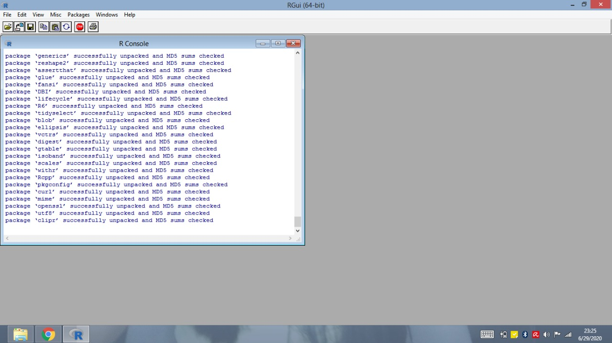

Lokakarya Dasar-dasar Pengolahan Data menggunakan MS Excel dan R -
Penelitian Unggulan Program Studi (PUPS)
================
Instruktur: [Gede Primahadi Wijaya
Rajeg](https://udayananetworking.unud.ac.id/lecturer/880-gede-primahadi-wijaya-rajeg)
<a itemprop="sameAs" content="https://orcid.org/0000-0002-2047-8621" href="https://orcid.org/0000-0002-2047-8621" target="orcid.widget" rel="noopener noreferrer" style="vertical-align:top;"></a>
(26 - 29 Juli 2021)

- <a href="#lisensi-materi-lokakarya"
  id="toc-lisensi-materi-lokakarya">Lisensi materi lokakarya</a>
- <a href="#pengantar" id="toc-pengantar">Pendahuluan</a>
- <a href="#isi-workshop" id="toc-isi-workshop">Pokok bahasan</a>
- <a href="#instalasi" id="toc-instalasi">Instalasi peranti untuk
  lokakarya</a>
- <a href="#unduh-materi" id="toc-unduh-materi">Cara mengunduh materi
  lokakarya</a>
- <a href="#daftar-pustaka" id="toc-daftar-pustaka">Daftar pustaka</a>

<!-- README.md is generated from README.Rmd. Please edit that file -->

# Lisensi materi lokakarya

<a rel="license" href="http://creativecommons.org/licenses/by-nc-sa/4.0/"></a>
[](https://zenodo.org/badge/latestdoi/372651834)<br />Materi
lokakarya dalam repositori GitHub ini diberikan lisensi
<a rel="license" href="http://creativecommons.org/licenses/by-nc-sa/4.0/">Creative
Commons Attribution-NonCommercial-ShareAlike 4.0 International
License</a>.

Harap memberikan kutipan berikut jika materi (data dan kode pemrograman
R) pada repositori ini ([Rajeg 2021](#ref-rajeg_lokakarya_2021))
digunakan untuk aktivitas akademik lebih lanjut:

> Rajeg, Gede Primahadi Wijaya. (2021, July 24). Lokakarya pengolahan
> data mendasar dengan MS Excel dan R (Version 1.0). Zenodo.
> <http://doi.org/10.5281/zenodo.5131785>

<!-- badges: start -->
<!-- badges: end -->

# Pendahuluan

Lokakarya daring ini ditujukan untuk dua orang anggota peneliti
mahasiswa (Putu Dea Indah Kartini dan [I Gede Semara Dharma
Putra](https://figshare.com/authors/I_Gede_Semara_Dharma_Putra/11755628))
yang menjadi bagian dari Penelitian Unggulan Program Studi (PUPS)
berjudul [**MODEL KAJIAN TERJEMAHAN BERBASIS BANK DATA TERJEMAHAN
DIGITAL INGGRIS-INDONESIA DAN IMPLIKASI
PEDAGOGISNYA**](https://udayananetworking.unud.ac.id/lecturer/research/880-gede-primahadi-wijaya-rajeg/a-model-for-translation-study-based-on-english-indonesian-translation-database-and-its-pedagogical-implication-1179)
pada Program Studi [**Sastra Inggris**](https://sasing.unud.ac.id),
[**Fakultas Ilmu Budaya**](https://fib.unud.ac.id), [**Universitas
Udayana**](https://www.unud.ac.id), Bali. Untuk mendapatkan latar
belakang lebih rinci terkait topik penelitian, berikut ini rekaman
[presentasi proposal](https://youtu.be/2myhItVlhao) dan
[seminar](https://youtu.be/xQ3YKag8yPw) untuk sebagian hasil penelitian
([Rajeg, Rajeg, Putra, et al. 2021a](#ref-rajeg_derajat_2021)). **Hasil
utuh penelitian tersebut dapat diakses *secara terbuka* melalui [arikel
jurnal](https://ejournal.undip.ac.id/index.php/parole/article/view/43717)
([Rajeg and Rajeg 2022](#ref-rajeg_corpus_2022)), [makalah
prosiding](https://doi.org/10.6084/m9.figshare.17078369) ([Rajeg, Rajeg,
Kartini, et al. 2021](#ref-rajeg_pemanfaatan_2021)), dan [laporan
penelitian](https://doi.org/10.31219/osf.io/eaj57) ([Rajeg, Rajeg,
Putra, et al. 2021b](#ref-rajeg_model_2021)).**

Dalam lokakarya ini, anggota peneliti mahasiswa mendapat pelatihan dan
pemahaman dasar dalam pengelolaan dan analisis data kuantitatif
menggunakan Microsoft Excel dan bahasa pemrograman
[R](https://www.r-project.org) ([R Core Team 2021](#ref-rcoreteam)).
Data yang digunakan dalam lokakarya ini berasal dari sebagian data
penelitian tersebut.

Tujuan diadakannya lokakarya ini adalah untuk membekali mahasiswa bidang
humaniora keterampilan dasar dalam pengolahan data dan analisis
kuantitatif mendasar menggunakan peranti komputasional mutakhir untuk
penelitian mereka nantinya (mis. dalam penulisan tugas akhir). Hal ini
penting karena penelitian-penelitian dalam bidang ilmu humaniora,
khususnya bahasa/linguistik, setakat ini mulai memanfaatkan data
kebahasaan berukuran besar (yaitu korpus bahasa), serta menggabungkan
pendekatan kuantitatif dan kualitatif.

# Pokok bahasan

Berikut ini adalah pokok-pokok bahasan dalam lokakarya kali ini:

1)  Hari Pertama
    1)  Pemahaman tentang keteraturan pengorganisasian data (*tidy
        data*) ([Wickham 2014](#ref-wickham_tidy_2014); [Broman and Woo
        2018](#ref-broman_data_2018)).
    2)  Penyimpanan data kebahasaan dan analisis kualitatif terkait
        variabel-variabel linguistik yang dikaji (*coding*/*annotation*)
        dalam MS Excel ([Broman and Woo 2018](#ref-broman_data_2018)).
    3)  Menyarikan secara kuantitatif hasil analisis kualitatif dalam MS
        Excel menggunakan *pivot table*.
    4)  Mengekspor data dalam format MS Excel ke dalam format
        *Tab-separated Plain Text* untuk nantinya diolah menggunakan R.
2)  Hari Kedua - Hari Keempat
    1)  Pengenalan dasar R, mengunggah data tabel ke R, dan eksplorasi
        dasar. (H2)
    2)  Menyarikan secara kuantitatif (mis. menghitung hasil observasi
        dari) analisis kualitatif dengan R. (H3)
    3)  Visualisasi dasar (mis. diagram batang) untuk variabel
        nominal/kategorikal/kualitatif. (H4)

# Instalasi peranti untuk lokakarya

Peranti yang diperlukan untuk lokakarya ini adalah MS Excel,
[R](https://cran.r-project.org), dan juga
[RStudio](https://www.rstudio.com/products/rstudio/download/). R dan
RStudio dapat diunduh secara gratis.

Setelah mengunduh R dan RStudio, silakan install packages dari
[`tidyverse`](https://www.tidyverse.org) ([Wickham et al.
2019](#ref-wickham_welcome_2019)) melalui console R. Package *tidyverse*
adalah suatu ekosistem mutakhir dan populer saat ini di R untuk
pengolahan data (*data science*) ([Wickham and Grolemund
2017](#ref-wickham_r_2017)). Ketik kode berikut lalu tekan ENTER untuk
menginstal `tidyverse` (**instalasi memerlukan internet**):

``` r
install.packages("tidyverse")
```

atau install satu persatu package tersebut (disarankan menggunakan cara
sebelumnya):

``` r
install.packages(c("dplyr", "tidyr", "ggplot2", "readr", "stringr", "purrr", "tibble", "forcats"))
```

Gambar-gambar berikut menunjukkan proses instalasi `tidyverse` yang
sedang berjalan melalui konsol aplikasi R (untuk Windows) – Kontribusi
tangkapan layar berikut berasal dari Ketut Santi Indriani, S.S., M.Hum
(Prodi Sastra Inggris, Fakultas Ilmu Budaya, Universitas Udayana).

1.  Proses instalasi sedang berjalan (1)

    

2.  Proses instalasi sedang berjalan (2)

    

3.  Proses instalasi completed (ditandai dengan keterangan “the
    downloaded binary packages are in ….”)

    

Untuk memastikan package `tidyverse` telah terinstal, jalankan kode
`library(tidyverse)` pada konsol R. Gambar berikut akan muncul:

<!-- -->

# Cara mengunduh materi lokakarya

1.  Kunjungi laman:
    <https://github.com/gederajeg/pups-english-dept-workshop>

2.  Kemudian, perhatikan kotak hijau bertuliskan `Code`. Klik tanda
    panah putih kecil pada kotak hijau tersebut, lalu pada kotak dialog
    yang keluar, pilih `Download ZIP`. Perhatikan gambar berikut:

    

3.  Selanjutnya silakan ekstraksi (*unzip*) berkas ZIP tersebut jika,
    setelah mengunduh, tidak secara otomatis diekstraksi/di-*unzip*.

4.  Kemudian, materi lokakarya akan terdapat dalam direktori (*folder*)
    dengan nama `pups-english-dept-workshop-main`. Perhatikan gambar
    berikut:

    

    Data utama untuk lokakarya ditunjukkan oleh berkas bernama
    `ROB_sample_conc_main.xlsx` (format MS Excel) dan
    `ROB_sample_conc_main.tsv` (format *Tab-separated plain text*).
    Berkas dengan awalan angka 1 - 3 dan diakhiri dengan `.R` adalah
    kode pemrograman R yang berisi langkah-langkah pengolahan data, dan
    analisis kuantitatif dan visualisasi dasar yang menjadi topik
    bahasan lokakarya.

5.  Selanjutnya, klik dua kali berkas dengan nama
    `2021-05-25-PUPS-ds-workshop.Rproj` untuk membuka peranti RStudio
    yang berkaitan dengan bahan-bahan lokakarya dalam direktori
    tersebut. Gambar berikut memperlihatkan tampilan RStudio yang
    terbuka setelah meng-klik `2021-05-25-PUPS-ds-workshop.Rproj`:

    

    Panel di pojok kanan bawah menampilkan isi direktori/folder dari
    `pups-english-dept-workshop-main`.

# Daftar pustaka

<div id="refs" class="references csl-bib-body hanging-indent">

<div id="ref-broman_data_2018" class="csl-entry">

Broman, Karl W., and Kara H. Woo. 2018. “Data Organization in
Spreadsheets.” *The American Statistician* 72 (1): 2–10.
<https://doi.org/10.1080/00031305.2017.1375989>.

</div>

<div id="ref-rcoreteam" class="csl-entry">

R Core Team. 2021. *R: A Language and Environment for Statistical
Computing*. Vienna, Austria: R Foundation for Statistical Computing.
<https://www.R-project.org/>.

</div>

<div id="ref-rajeg_lokakarya_2021" class="csl-entry">

Rajeg, Gede Primahadi Wijaya. 2021. *Lokakarya Pengolahan Data Mendasar
Dengan MS Excel Dan R* (version v1.0). Zenodo.
<https://doi.org/10.5281/ZENODO.5131785>.

</div>

<div id="ref-rajeg_corpus_2022" class="csl-entry">

Rajeg, Gede Primahadi Wijaya, and I Made Rajeg. 2022. “A Corpus
Linguistic Study of Constructional Equivalence for the Indonesian
Translation of ROB and STEAL Based on the OpenSubtitles Parallel
Corpus.” *PAROLE: Journal of Linguistics and Education* 12 (2): 28–48.
<https://ejournal.undip.ac.id/index.php/parole/article/view/43717>.

</div>

<div id="ref-rajeg_pemanfaatan_2021" class="csl-entry">

Rajeg, Gede Primahadi Wijaya, I Made Rajeg, Putu Dea Indah Kartini, and
I Gede Semara Dharma Putra. 2021. “Pemanfaatan Bank-Data Digital
Dwibahasa Dalam Kajian Terjemahan: Studi Kasus Padanan Bahasa Indonesia
Untuk Verba Sinonim Bahasa Inggris ROB & STEAL.” In *Prosiding Seminar
Nasional Sains Dan Teknologi (SENASTEK) 2021*, 0831–35. Bali, Indonesia:
Lembaga Penelitian dan Pengabdian kepada Masyarakat (LPPM) Universitas
Udayana. <https://doi.org/10.6084/m9.figshare.17078369>.

</div>

<div id="ref-rajeg_derajat_2021" class="csl-entry">

Rajeg, Gede Primahadi Wijaya, I Made Rajeg, I Gede Semara Dharma Putra,
and Putu Dea Indah Kartini. 2021a. “Derajat Kesepadanan Konstruksional
Terjemahan Verba Bahasa Inggris *ROB* Dalam Bahasa Indonesia.” Paper
presented at the Seminar Nasional Bahasa Ibu (SNBI) 2021.
<https://youtu.be/xQ3YKag8yPw>.

</div>

<div id="ref-rajeg_model_2021" class="csl-entry">

———. 2021b. “Model Kajian Terjemahan Berbasis Bank Data Terjemahan
Digital Inggris-Indonesia Dan Implikasi Pedagogisnya.” Laporan
Penelitian. Denpasar, Bali, Indonesia: Universitas Udayana.
<https://doi.org/10.31219/osf.io/eaj57>.

</div>

<div id="ref-wickham_tidy_2014" class="csl-entry">

Wickham, Hadley. 2014. “Tidy Data.” *Journal of Statistical Software* 59
(1, 1): 1–23. <https://doi.org/10.18637/jss.v059.i10>.

</div>

<div id="ref-wickham_welcome_2019" class="csl-entry">

Wickham, Hadley, Mara Averick, Jennifer Bryan, Winston Chang, Lucy
McGowan, Romain François, Garrett Grolemund, et al. 2019. “Welcome to
the Tidyverse.” *Journal of Open Source Software* 4 (43): 1686.
<https://doi.org/10.21105/joss.01686>.

</div>

<div id="ref-wickham_r_2017" class="csl-entry">

Wickham, Hadley, and Garrett Grolemund. 2017. *R for Data Science*.
Canada: O’Reilly. <http://r4ds.had.co.nz/>.

</div>

</div>
